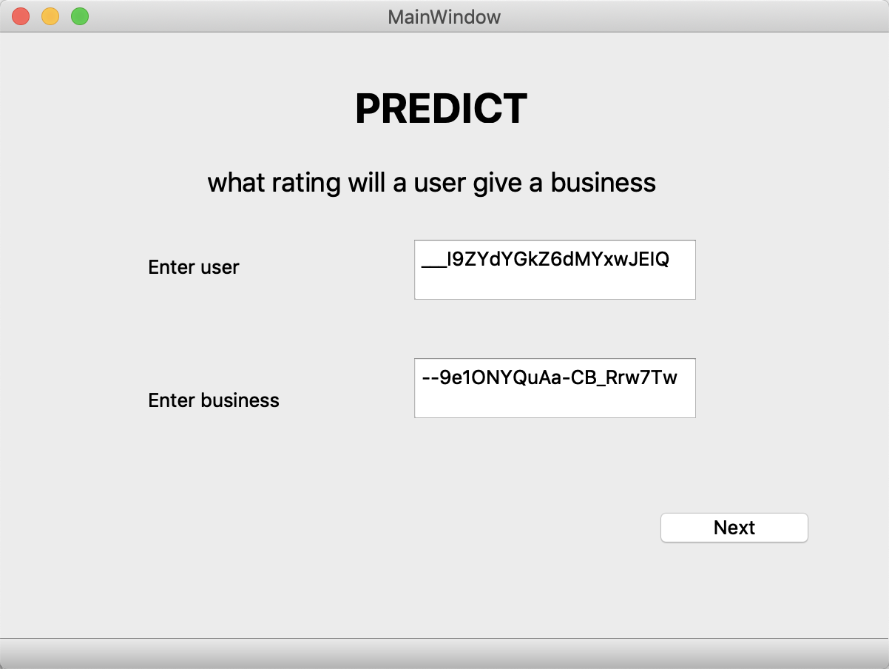
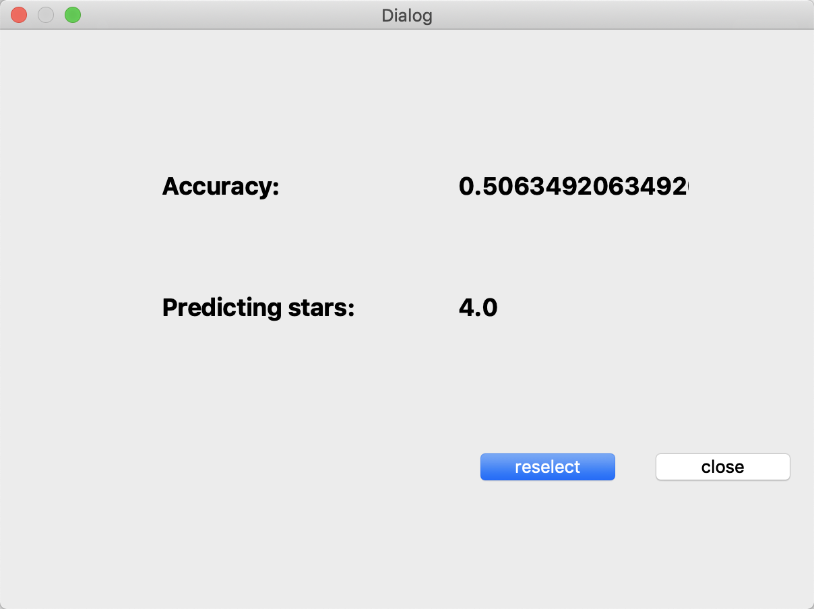

# ECE656project

## Introduction
We implement data study and analysis on Yelp dataset, including data trend presentation and data prediction, which is the most import part of our project. For the prediction, the system has a client/server application, which allows client to choose what they think important and reasonable to make server implement data-clean and data-mining (decision-tree classifier).

## Part 0. Code Environment and How to Run
### Part 0.1 Code Environment
- Client-side: PyQt5
- Server-side: Python with pymysql
- Database: MySQL
- Data storage: AWS - Relational Database Service 

### Part 0.2 Run 
After installing PyQt5 and pymysql, run *drive.py* in IDE or terminal. A window will be showed which is the application we implemented.

## Part 1. Data Cleaning
See __dataclean.sql__
#### Part 1.1 Sanity Checks
##### Part 1.1.1 Time Checks
1. anything can not occur before yelp-founded time or from the future
(including review time, elite time, tip time, user start time)
2. review can not be left before the user account is created
3. a user can not become an elite member before becoming a yelp user

##### Part 1.1.2 Logical Consistency Checks
1. id check, id cannot be null in all tables
2. user's review_count should not be less than those review sum in the review table, which means this user's data in the user table is outdated

#### Part 1.2 Representative Limit (optional)
1. filter users whose review_count < a threshold out
2. filter users whose average ratings = 5 or 1

## Part 2. Data Analysis

___User Ratings Prediction___
_Predict what rating a user will give a business based on how s/he has rated other businesses and how others have rated that business?_
 
#### Part 2.1 Client Side
- select the user and business they want to predict -- _MainWindow.py_
- decide whether to clean data -- _ChooseDialog.py_
- select what attributes from the database they think import  -- _ChooseDialog.py, choosedialog_ui.py_
- decide whether to restart and change the attributes after being showed the result  --  _ChooseDialog.py, ResultDialog.py_

#### Part 2.2 Server Side
- connect to the database -- _drive.py_
- implement the data-clean procedure based on the client choice -- _ChooseDialog.py_
- implement __Decision Tree Algorithm__ based on the attributes the client choose -- _decision_tree.py_

#### Part 2.3 Application Demo
 
 
 
